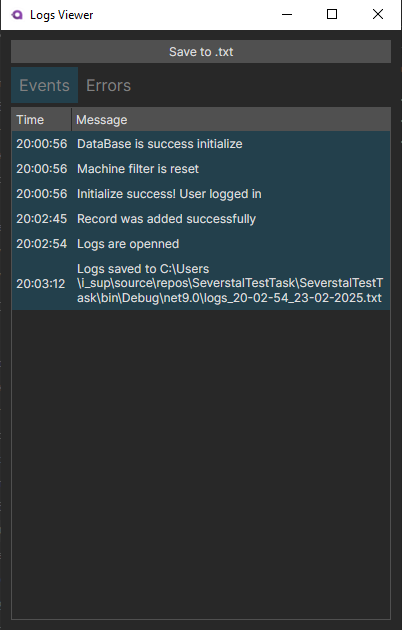

## Графический интерфейс для асинхронного вывода данных
### Описание проекта
- [x] Реализовать графический интерфейс на XAML (WPF), в котором будет реализован асинхронный вывод данных в таблицу и построение графика по модели данных. Добавление новой записи в таблицу путем нажатия на кнопку.

- [x] Модель данных можно выбрать любую, в том числе и данные, входящие в АПК, например – урожайность пшеницы за последний год. Наиболее продуктивным вариантом будет реализовать выборку из базы данных со следующими столбцами: номер машины, вес брутто, вес тары, вес нетто, дата тары, дата брутто.

### Плюсом будет:
- [x] реализация выбора машины из списка или справочника (по кнопке)
- [x] внесение в базу данных в асинхронном порядке
- [ ] чтение какого-либо файла в background процессе
- [x] использование интерфейсов
- [x] запись логов события (разделить на лог события и лог ошибки)
- [x] использование MVVM
- [x] использование Avalonia
- [x] использование EF

## Общий интерфейса приложения

## Фильтр по машине №95 и добавление новой записи

## Логи и сохранение в файл

## График по машине №95

